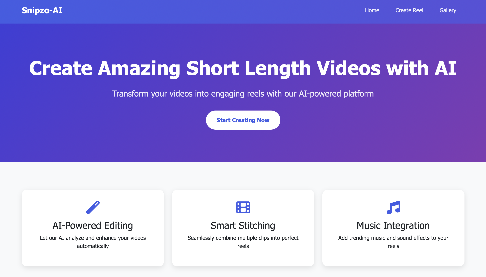
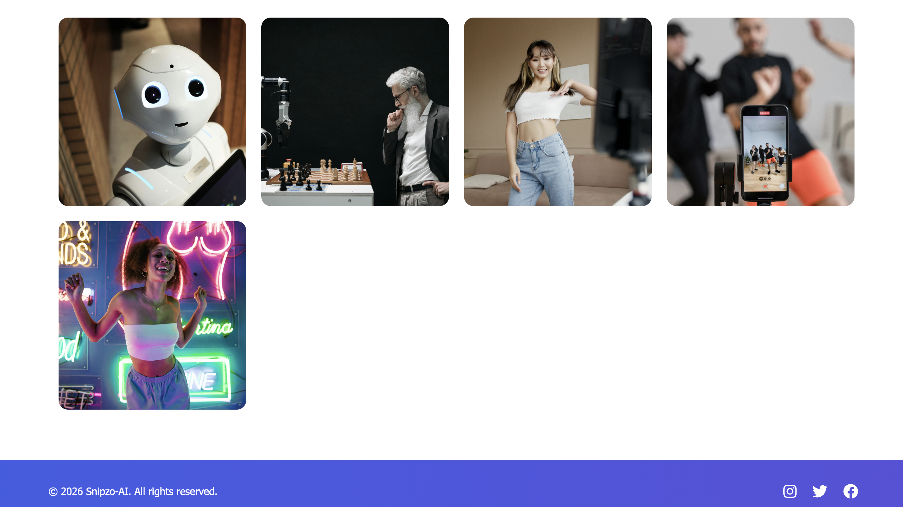
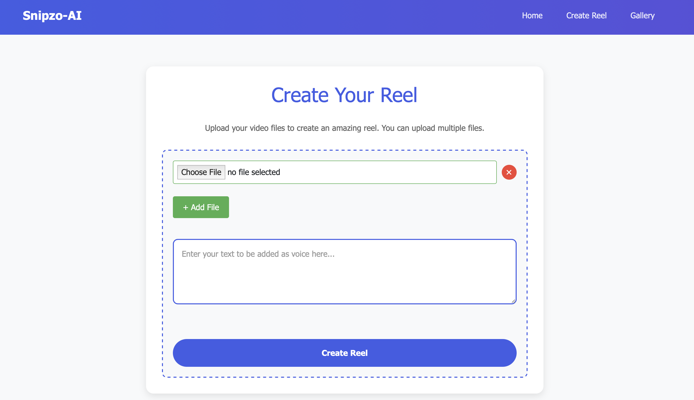

# 🎬 Snipzo Reel AI

<p align="center">
  <b>Create stunning reels from images using AI-generated voice</b><br>
  A mini reel maker powered by ElevenLabs 🎤 + FFmpeg 🎬
</p>

---

## 🚀 Overview

Snipzo Reel AI is a web application that lets you create reels by combining:

* 📸 Images
* 🎤 AI-generated voice (ElevenLabs)
* 🎬 Automatic video generation

It works like a **mini reel creator**, turning static images into dynamic video content.

---

## 🧩 Features

### 🏠 Home Page

* Clean landing page
* Easy navigation

### 🎬 Create Page

* Upload multiple images
* Generate AI voice
* Automatically generate reel

### 🖼️ Gallery Page

* View generated reels
* Preview uploaded content

---

## ⚙️ How It Works

1. Upload images 📸
2. Generate voice using ElevenLabs 🎤
3. Process media using FFmpeg 🎬
4. Export final reel 🎥

---

##  🔑 API Key

* This project uses the ElevenLabs API.
* Create a .env file in the root folder:

--

## 🛠️ Tech Stack

* ⚙️ Python (Flask)
* 🎤 ElevenLabs API
* 🎬 FFmpeg
* 🌐 HTML, CSS

---

## 📸 Application Screenshots

<p align="center">
  
  
</p>

<p align="center">
  
  
</p>

---

## 🎥 Demo Reel

<p align="center">
  <a href="sample_outputs/reel1.mp4">
    
  </a>
</p>

<p align="center">
  ▶️ Click the image to watch the reel
</p>

---

## ⚙️ Setup

```bash
git clone https://github.com/your-username/Snipzo-Reel-AI.git
cd Snipzo-Reel-AI
pip install -r requirements.txt
```

---

## ▶️ Run

```bash
python main.py
```

---

## 📂 Project Structure

```
main.py
generate_process.py
text_to_audio.py
templates/
static/
sample_outputs/
requirements.txt
```

---

## ⚠️ Requirements

* FFmpeg installed on your system
* ElevenLabs API key

---

## 🧪 Debug Info (Optional)

During reel generation, image processing details are logged in the terminal.
This helps track the workflow and debug issues during development.

---

## 💡 Future Improvements

* ✨ Add transitions between images
* 📝 Add subtitles to reels
* 🎨 Improve UI/UX
* 📱 Mobile optimization
* 🗄️ Integrate a database for storing reels, metadata, and user activity

---

## ⭐ Support

If you like this project, consider giving it a ⭐ on GitHub! add that to this